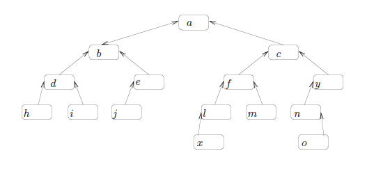

# Homework 1

## Problem 1

Order the following list of functions by the big-O notation. Group together (for
example, by underlining) those functions that are big-Theta of one another.

| <small>1-4</small> | <small>5-8</small> | <small>9-12</small> | <small>13-16</small> | <small>17-20</small> |
| :---: | :---: | :---: | :---: | :---: |
| $4^n$ | $n^3$ | $n^2 \log n$ | $4^{\log n}$ | $\sqrt{\log n}$ |
| $2^{2^n}$ | $⌈\sqrt{n}⌉$ | $n^{0.01}$ | $1/n$ | $4n^{3/2}$ |
| $3n^{0.5}$ | $5n$ | $⌊2n \log^n n⌋$ | $2^n$ | $n \log_4 n$ |
| $6n \log n$ | $2^{100}$ | $\log \log n$ | $\log^2 n$ | $2^{\log n}$ |

> When in doubt about two functions $f(n)$ and $g(n)$, consider $\log f(n)$ and $\log g(n)$ or
$2^{f(n)}$ and $2^{g(n)}$

### Answer

Answer in increasing order, and colored by performance group.

| <small>1-4</small> | <small>5-8</small> | <small>9-12</small> | <small>13-16</small> | <small>17-20</small> |
| :---: | :---: | :---: | :---: | :---: |
| $1/n$ | $\log^2 n$ | $\color{limegreen} 2^{\log n}$  | $\color{orange} 6n \log n$ | $n^3$ |
| $2^{100}$ | $n^{0.01}$ | $\color{limegreen} 5n$ | $⌊2n \log^n n⌋$ | $\color{red} 2^n$ |
| $\log \log n$ | $\color{green} ⌈\sqrt{n}⌉$ | $4n^{3/2}$ | $4^{\log n}$ | $\color{red} 4^n$ |
| $\sqrt{\log n}$ | $\color{green} 3n^{0.5}$ | $\color{orange} n \log_4 n$ | $n^2 \log n$ | $\color{red} 2^{2^n}$ |

## Problem 2

Matrix multiplication. Write pseudocode for computing $C = A.B$, where $A,B,C$
are matrices of integers of size $n.m, m.k, n.k$ respectively. Analyze the
running time of your algorithm, as a function of $n, m, k$.

### Answer

```
length(A): n * m
length(B): m * k
length(C): n * k

matrixMultiply(A, B):
  C = Array(n * k)
  for i in range(0, n - 1)
    for j in range(0, k - 1)
      for k in range(0, m - 1)
        C[i][j] = C[i][j] + A[i][k] * B[k][j];
  return C
```

**The time complexity of function above is $\bf O(n.m.k)$**.

## Problem 3

You are given a tree represented by the following data structure. Nodes have
three fields: element, left-child, and right-child. The element is a integer.
Write a procedure (pseudocode) with input parameter the location of the root
node (or pointer to the root node), and that computes the average value of the
elements in the tree. However, do not use recursion. Use a stack instead.
Analyze the running time of your algorithm, as a function of the number of nodes
in the tree. As proven in CS 331, stack operations are $O(1)$.

### Answer

Without stack:

```
sum(T):
  if T == null
    return 0
  if (T.left == null) and (T.right == null)
    return T.value
  return sum(T.left) + T.value + sum(T.right)

avg(T):
  return sum(T) / length(T)
```

With stack:

```
sum(T):
  if T == null
    return 0
  if (T.left == null) and (T.right == null)
    return T.value

  S = Stack()
  sum = 0
  push(S, T)

  while (length(S) > 0) {
    E = pop(S)
    sum += E.value
    if E.left != null
      push(S, E.left)
    if E.right != null
      push(S, E.right)
  }
  return sum
```

## Problem 4

Give pseudocode for the following problem: given an array $A[1 \ldots n]$
containing the numbers $1,2,\ldots,n$ and representing a permutation, modify $A$
to represent the next lexicographic permutation. Analyse running time (which
should not exceed $O(n)$) and argue correctness (why the output is
lexicographically bigger than the input? why other permutations
lexicographically bigger than the input are bigger than the output?).

### Answer

```
nextPermutation(A, n):
  # find inverse point
  x = n - 2
  while (x >= 0) and (A[x] >= A[x + 1])
    x -= 1

  # start of the array is last lexicographic permutation
  if x == 0
    return

  # traverse to find the next greater than inverse point
  for i in range(n - 1, x, -1)
    if A[x] < A[i]
      swap(A, x, i)
      break
  A[x + 1] = reversed(A[x + 1])

  return A
```

## Problem 5

What is the running time of HEAPSORT on an array $A$ that is sorted in
decreasing order? Use an $\Omega()$ approximation and justify you answer.

### Answer

**When the array is sorted in decreasing order, the heap sort takes
$\bf \Omega(n \log n)$ time**. Each of the $n-1$ calculation to MAX-HEAPIFY
takes $\Omega(\log n)$ time. The heap will be built in linear time as the
elements of the array are in decreasing order. Therefore the maximum running
time of heap sort will be $\Omega(n \log n)$.

## Extra Problem 1

Augment the stack data structure to do in constant time, besides push/insert and
pop/remove, findmin. Describe the data structure, and present pseudocode for
push/insert, pop/remove, and findmin. Argue that each operation takes constant
time. Argue that findmin correctly returns the element with minimum key.

### Answer

```
n = 100
i = -1
A = Array(n)

push(E):
  if i >= n - 1
    return null
  A[i++] = E

pop():
  if i <= 1
    return null
  return A[i--]

findmin():
  min = MAX_INTEGER
  for j in range(0, i)
    if min > A[j]
      min = A[j]
  return min
```

## Extra Problem 2

Suppose we are given a $n$-element sequence $S$ such that each element in $S$
represents a different vote in an election, where each vote is given as an
integer representing the ID of the chosen candidate (these IDs come from the
range $1 \ldots n^5$). Suppose you know the number $k < n$ of candidates
running. Describe a $O(n \log k)$ worst-case algorithm for determining who wins
the election. (Thus hashing will not work, as it does not have a good enough
worst-case guarantee). The space requirement is $O(n)$, so a table of size $n^5$
cannot be used. Argue that your running time is correct. Note that $k$ could be
much smaller than $n$ and $O(n \log n)$ is only a partial solution.

### Answer

Start by sorting the list, which takes $O(n \log n)$ time. Then move through the
list, keeping track of the which candidate has the most votes so far, and how
many votes they have received. If the number of votes for the current candidate
exceeds the previous maximum, make it the new new maximum. The second (counting)
stage takes $O(n)$ time, so the whole process takes $O(n \log n)$ time.

In last case when $K < n$ , the candidates can be stored in a balanced binary
tree (for example, an AVL Tree). Each node should store a student ID and the
number of votes they have received so far. As each vote in the sequence is
processed, search the tree for the student ID of the chosen candidate (which
takes $O(\log k)$ time). If the ID is found, add one to its number of votes.
Otherwise, create a new node with this ID and with one vote. At the end, go
through all the nodes in the tree to find the one with the most votes.

## Extra Problem 3

You are given a tree represented by the following data structure. Nodes have
three fields: element, parent, and auxiliary. The auxiliary field is $0$ and is
there to help during traversals. In this problem your algorithm should leave the
tree unchanged. You are given the location (or pointer to) two nodes $x$
and $y$. The goal is to print the elements on the path from $x$ to $y$ in tree,
in time proportional to the length of the path. That is, if the tree has $n$
nodes and this path has length $k$, the running time of the algorithm should
be $O(k)$ ($O(n)$ is not good enough, and the tree does not have to be
balanced). See Figure 1 for an example, where the path from $x$ to $y$
is $\{x,l,f,c,y\}$ and has length $k=4$. Argue that your algorithm algorithm
indeed has running time $O(k)$. Don’t forget to bring back the tree to its
original state. Present pseudocode.



### Answer

```
printRange(x, y):
  # keep nodes in queue because traversing backwards from y to x
  Q = Queue()
  current = y
  while current != x
    push(Q, current)
    current = current.parent
  # print queue
  for E in Q
    print(E.value)
```

**The run time of the given algorithm is $\bf O(k)$**.

## Extra Problem 4

We are given two arrays of size $n$ $A$ and $B$, of integers, Consider the $n$
closed intervals $[A[i],B[i]]$, which may not be disjoint. The union of
these $n$ intervals is another set of intervals, which can be made disjoint and
maximal. Present an $O(n \log n)$ algorithm to output this new set of disjoint
and maximal intervals into arrays $C$ and $D$. Present pseudocode and analyze
the running time. Two sets are disjoint if they have no common elements.
Consider, for example, $A=\{6,1,4,9,12\}$ and $B=\{9,3,7,11,14\}$. The intervals
are $[6,9], [1,3], [4,7], [9,11], [12,14]$. Here $[6,9]$ and $[4,7]$ are not
disjoint. Also, with closed intervals, 9 belongs to both $[4,9]$ and $[9,11]$,
and thus $[4,9]$ and $[9,11]$ are not disjoint. Then, one of the solutions can
be $C=\{4,1,12\}$ and $D=\{11,3,14\}$, which represent disjoint and maximal
intervals. Another valid solution would be $C=\{1,4,12\}$ and $D=\{3,11,14\}$.

### Answer

```
compareInterval(A, B):
  return A[0] < B[0]

mergeIntervals(A, n):
  if n <= 0
    return

  S = Stack()
  sort(A)
  push(s, A)
  for i in range(1, n)
    top = peek(S)
    if (top[1] < A[i][0])
      push(S, A[i])
    else if top[1] < A[i][1]
      top[1] = A[i][1]
      pop(S)
      push(S, top)

  return S
```

Steps:

- Sort all intervals in increasing order of start time.
- Traverse sorted intervals starting from first interval, do following for every
  interval.
- If current interval is not first interval and it overlaps with previous
  interval, then merge it with previous interval. Keep doing it while the
  interval overlaps with the previous one.
- Else add current interval to output list of intervals. Time complexity of the
  method is $O(n \log n)$ which is for sorting. Once the array of intervals is
  sorted, merging takes linear time. A $O(n \log n)$ and $O(1)$ extra space
  solution. The above solution requires $O(n)$ extra space for the stack. We can
  avoid the use of extra space by doing merge operations in-place. Below are
  detailed steps.

## Extra Problem 5

Suppose we are given two sorted arrays $S$ and $T$, each with $n$ items.
Describe an $O(\log n)$-time algorithm for finding the $k$-th smallest key in
the union of the keys from $S$ and $T$ (assuming no duplicates). Present
pseudocode, argue correctness and analyze the running time.

### Answer

```
kthSmallest(S, T, k):
  if length(S) == 0
    return T[k]
  else if length(T) == 0
    return S[k]

  m1 = length(S)
  m2 = length(T)

  if m1 + m2 < k
    if S[m1] > T[m2]
      return kthSmallest(S, T[m2 + 1], k - m2 - 1)
    else
      return kthSmallest(S[m1 + 1], T, k - m1 - 1)
  else
    if S[m1] > T[m2]
      return kthSmallest(S[m1], T, k)
    else
      return kthSmallest(S, T[m2], k)
```

And it takes $\log n . \log n = \log n^2$. **So the time complexity is
$\bf O(\log n^2)$**.

## Extra Problem 6

Suppose that you have a “black-box” worst-case linear-time median subroutine.
(the median of n numbers is the $⌈n/2⌉$-th smallest element, i.e. the median
of $\{1,2,4,7,11,94\}$ is $4$). Give a simple, linear-time algorithm that, given
an array $A[1 \ldots n]$ and a positive integer $i \le n$ finds the $i$-th
smallest element of $A$. Present pseudocode using procedures from the textbook
or notes; give complete specifications and state the running time of the
procedure in terms of its parameters.

### Answer

```
ithSmallest(A, i):
  mid = floor(A.length / 2)
  x = BlackBox(A)
  if i == mid
    return x
  if i < mid
    return ithSmallest(subarray(A, 0, mid), i)
  else
    return ithSmallest(subarray(A, mid + 1, A.length), i)
```

Left and right have length approximately half of $n$ (since $x$ is the median).
In each call, recursive call is made to half the size of $n$. During a call,
steps (2) and (4) take $O(n)$ time.

Hence, $T(n) = T(n/2) + O(n)$

By *master's theorem*:

$n \log ba = n \log 21 = n_0 = 1$ which is asymptotically smaller than $n$.

**Thus by case (3) of master's theorem: $\bf T(n) = O(n)$**.

<!-- hotfix: KaTeX -->
<!-- https://github.com/yzane/vscode-markdown-pdf/issues/21/ -->
<script type="text/javascript" src="http://cdn.mathjax.org/mathjax/latest/MathJax.js?config=TeX-AMS-MML_HTMLorMML"></script>
<script type="text/x-mathjax-config">MathJax.Hub.Config({ tex2jax: { inlineMath: [['$', '$']] }, messageStyle: 'none' });</script>
