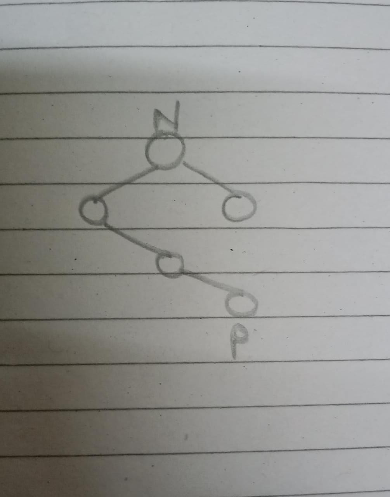
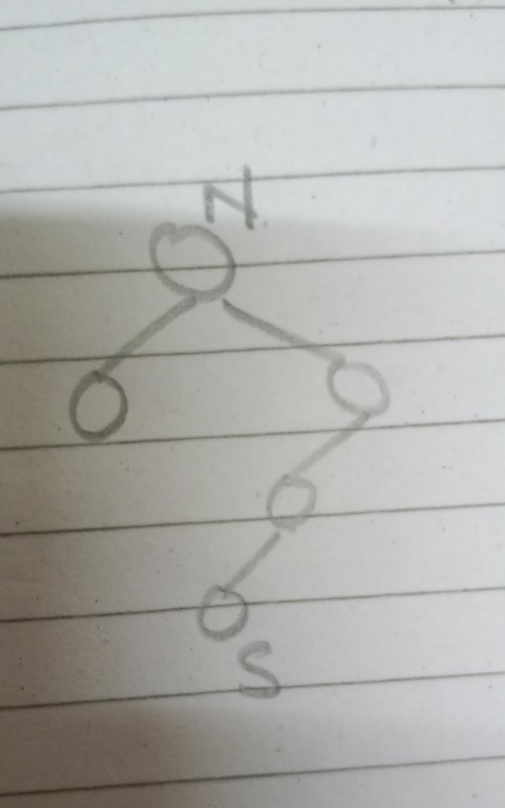
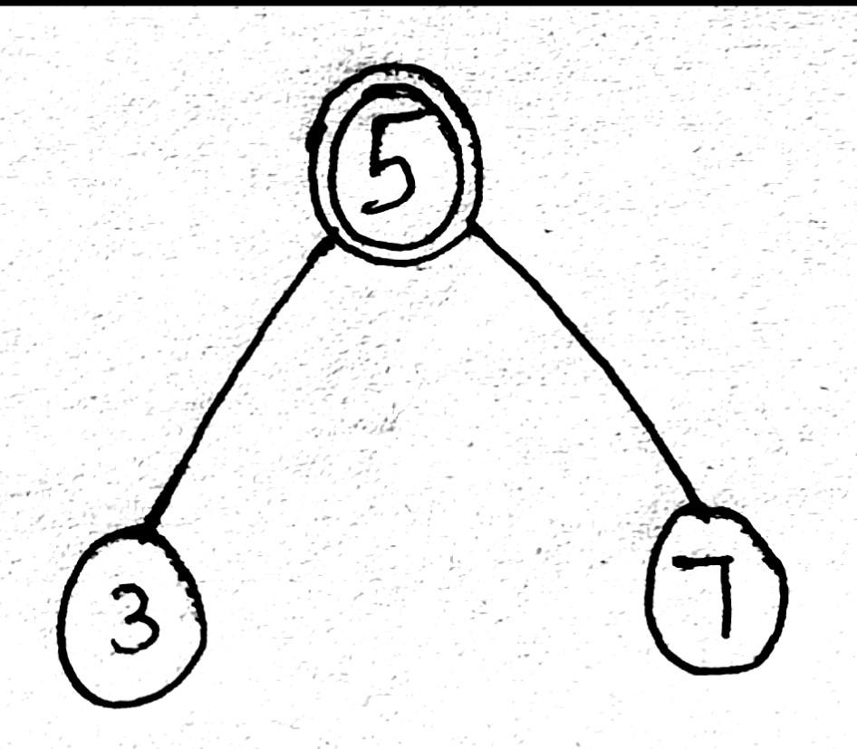
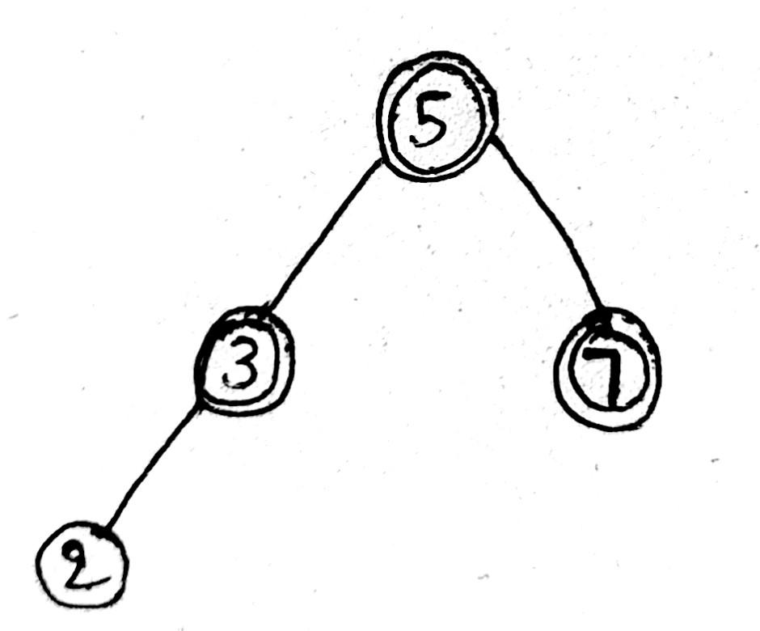
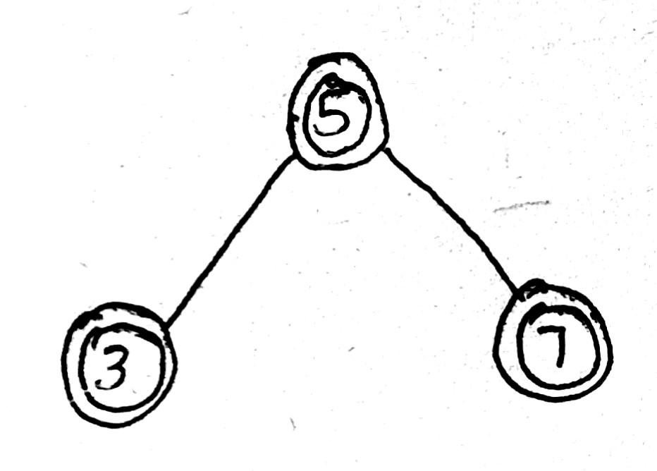

# Homework 2

## Problem 1

Assume the priority queue also must support the update `DELETE(A,i)`, where $i$
gives you the location in the data strucure where element $i$ is located. In a
binary heap, that would be $A[i]$. Write pseudocode to achieve `DELETE(A,i)`
in $O(\log n)$ time for binary heaps, where $n$ is the size of the heap. Justify
the running time.

### Answer

```
delete(A, i):
  last = A.length - 1
  r = A[i]
  A[i] = A[last--]
  parent = i / 2

  # filter A[i] up or down accordingly
  if (i == 1 || A[parent] < A[i])
    heapFilterDown(i) # move node A[k] down the tree
  else
    heapFilterUp(i) # move node A[k] up the tree
```

Time complexity analysis: in `delete()` function, we are mainly performing two
operations:

1. Replacing $i$-th node with rightmost node in constant time complexity $O(1)$.
2. Heapify-up/down: from the function, its clear that maximum number of swaps
  possible in these functions is equal to the height of heap which is of the
  order of $O(\log n)$.

**So, overall complexity is $\bf O(\log n) + O(1) =O(\log n)$**.

## Problem 2

Give an algorithm with worst-case running time of $O(k \log k)$ to print the $k$
biggest elements in a $n$-element max-heap (binary heap stored in an array)
without modifying the max-heap (or if you do modify it, restore it to the input
heap within the given time bound). For example, if the max-heap
is $A=\{100,88,44,66,77,11,22,5,55\}$ and $k=5$, the output could
be $100,88,66,77,55$ (the order in which the algorithm prints does not matter).
Do not assume $n = O(k)$. Here $n$ can be much larger than $k$. A correctness
proof is not needed (but your pseudocode must be correct). You can use
additional data structures. Argue the running time.

### Answer

```
kthBiggest(A):
  m = 2 ^ k - 1
  B = Array(m)
  for i in range(0, m - 1)
    B[i] = A[i]

  buildMaxHeap(A)
  for i in range(1, k)
    heapExtractMax(B)
    maxHeapify(B)
```

Contruct a new max heap using the front $2^k - 1$​​​​​​​ elements from the given array
(which is a max heap) Note the height of the new max heap is $k$. The maximum
element is present in the root node. We extract the maximum element from the
heap and convert it back to max heap. This step has a complexity $O(\log k)$.
**Since the previous step is performed $k$ times, hence total time complexity
$\bf k . O(\log k) = O(k \log k)$**.

## Problem 3

Using only the definition of a binary search tree, show that if a node in a
binary search tree has two children, then its successor has no left child and
that its predecessor has no right child. Here all the keys in the binary search
tree are distinct. The successor of a node $j$ is defined as follows: if the
node $j$ has the biggest key, the successor is NIL; otherwise the successor is
the node $i$ that has a key that is bigger than the key of $j$ and such that no
other node has key between the key of $i$ and the key of $j$.

### Answer

**Given**: If a node in a binary search tree has two children, then its sucessor
has no left child & its predecessor has no right child.

Successor of a node is the leftmost node in the right subtree. Therefore the
successor would not be having a left child anymore.

Similarly, Predecessor of a
node is the rightmost node in the left subtree. Therefore the predecessor would
not be having the right child.

| Predecessor | Sucessor |
| --- | --- |
|  |  |

## Problem 4

Suppose that a node $x$ is inserted into a red-black tree with RB-INSERT and
then is immediately deleted with RB-DELETE. Is the resulting red-black tree the
same as the initial red-black tree? Justify your answer.

### Answer

Consider an example.

| Initial | Insert 2 | Delete 2 |
| --- | --- | --- |
|  |  |  |

**Therefore true, it is clear that after insertion and deletion operation the
result red-black tree is not same as the initial red-black tree**.

## Problem 5

Suppose you are given two $n$-element sorted sequences $A$ and $B$, each
representing a set (none has duplicate entries). Describe an $O(n)$-time method
for computing a sequence representing the set $A \ B$ (with no duplicates; note:
the difference of sets $A$ and $B$ consists of those elements in $A$ and not
in $B$). You do not have to argue correctness (but, obviously, your method must
be correct), but must justify the running time.

### Answer

```
union(A, B, m, n):
  L = List()

  i, j = 0
  while (i < m) and (j < m)
    if A[i] < B[j]
      add(L, A[i++])
    else if A[i] > B[j]
      add(L, A[j++])
    else
      add(L, A[i++])
      add(L, A[j++])

  # print remaining
  while i < m
    add(L, A[i++])
  while j < n
    add(L, A[j++])

  return L
```

## Extra Problem 1

Present an algorithm with running time O(n) for the following problem: Given
array $A[1 \ldots n]$, find entries $1 \le i \le j$ n such that $A[j] − A[i]$ is
maximum among all such pairs $i < j$. As an example, if $A=\{5,9,1,4,7,2\}$,
output $i=3, j=5$. Make sure to include pseudocode, correctness and running time
arguments. A $O(n \log n)$-time algorithm is worth partial credit.
An $O(n^2)$-time algorithm is trivial and only gives half of score if complete.

> Hint: Dynamic programming.

### Answer

```
maxDifference(A):
  if A.length == 1
    return 0
  lowest = A[0]
  result = MAX_INTEGER
  for i in range(1, A.length)
    lowest = min(lowest, A[i])
    result = max(result, A[i] - lowest)
  return result
```

## Extra Problem 2

In an undirected graph G = (V,E), a clique is a subset A of vertices such that
any two distinct vertices of A are adjacent. A maximal clique $M$ is a clique
such that, if we were to add any additional vertex to $M$, then it would not be
a clique any longer. Every graph has a maximal clique. (Can you see this? This
question is not part of the exercise, but it is worth thinking about.) Give an
efficient algorithm that computes a maximal clique for an input graph $G$.

Present full pseudocode (using the format in the notes) and analyze the running
time. A correctness proof is not required (but the algorithm must be correct).
$O(|V |+|E|)$-time is achievable and needed for full marks.
$O(|V |+|E| log |E|)$-time can get up to 95% of the marks, and any algorithm
that is polynomial up to 85% of the marks.

### Answer

```
MAX = 100;
n = 0;
# Stores the vertices
store = [0] * MAX;
# Graph
graph = [[0 for i in range(MAX)] for j in range(MAX)];
# Degree of the vertices
d = [0] * MAX;
# Function to check if the given set of
# vertices in store array is a clique or not
def is_clique(b):
# Run a loop for all set of edges
for i in range(1, b):
for j in range(i + 1, b):
# If any edge is missing
if (graph[store[i]][store[j]] == 0):
return False;

return True;
# Function to find all the sizes
# of maximal cliques
def maxCliques(i, l):
# Maximal clique size
max_ = 0;
# Check if any vertices from i+1
# can be inserted
for j in range(i + 1, n + 1):
# Add the vertex to store
store[l] = j;
# If the graph is not a clique of size k then
# it cannot be a clique by adding another edge
if (is_clique(l + 1)):
# Update max
max_ = max(max_, l);
# Check if another edge can be added
max_ = max(max_, maxCliques(j, l + 1));

return max_;

# Driver code
if _name_ == '_main_':
edges = [[ 1, 2 ],[ 2, 3 ],[ 3, 1 ],
[ 4, 3 ],[ 4, 1 ],[ 4, 2 ]];
size = len(edges);
n = 4;
for i in range(size):
graph[edges[i][0]][edges[i][1]] = 1;
graph[edges[i][1]][edges[i][0]] = 1;
d[edges[i][0]] += 1;
d[edges[i][1]] += 1;

print(maxCliques(0, 1));
```

## Extra Problem 3

$G=(V,E)$ is an undirected graph whose edges have weight $w$. A subgraph of $G$
is called spanning if it has $V$ as its vertex set. A spanning subgraph of $G$
is identified with its set of edges. A spanning tree is minimum if the total
weight of its edges is minimum among all the spanning trees. Assume no two edges
have the same weight. Prove that the minimum spanning tree is unique in this
case. Show by example that the second-best minimum spanning tree need not be
unique. Explain why your example has the desired properties: show the minimum
spanning tree, and at least two distinct second-best minimum spanning trees.

### Answer

A minimum spanning tree or an MST of a graph is a tree that includes every
vertex of the graph, where all vertices will be connected and it will have the
minimum total weight possible.

The minimum spanning tree of a graph with distinct edge weights will be unique.

[View source](https://www.chegg.com/homework-help/questions-and-answers/g-v-e-undirected-graph-whose-edges-weight-w-subgraph-g-called-spanning-v-vertex-set-spanni-q75364114)

## Extra Problem 4

Suppose we are given a weighted directed graph $G=(V,E,c)$ with positive costs
on the edges, and two nodes $u, v 2 V$ . Give an efficient (polynomial)
algorithm for computing the number of shortest u − v paths in G. Do not attempt
to list all these paths! Present pseudocode, analyze the running time, and prove
correctness.

### Answer

For finding all the shortest paths from source node $u$ to destination node $v$
we will use the BFS algorithm. The approach will be as follows :

1. Enqueue the source node into the queue with the distance as $0$.
2. Now dequeue the node from the front of the queue visit all its neighbours and
  mark them visited and continue this until the queue is empty.
3. Whenever the destination node $v$ is encountered then check the distance if
  it is less than the shortest distance till now if yes then update the shortest
  distance.
4. If it is equal to the shortest distance then increment the count by $1$.


<!-- hotfix: KaTeX -->
<!-- https://github.com/yzane/vscode-markdown-pdf/issues/21/ -->
<script type="text/javascript" src="http://cdn.mathjax.org/mathjax/latest/MathJax.js?config=TeX-AMS-MML_HTMLorMML"></script>
<script type="text/x-mathjax-config">MathJax.Hub.Config({ tex2jax: { inlineMath: [['$', '$']] }, messageStyle: 'none' });</script>
