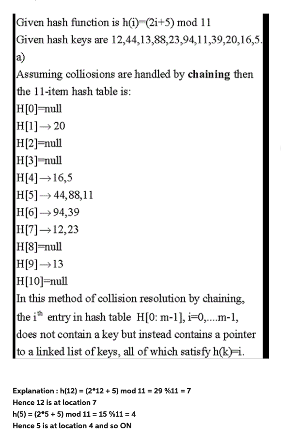
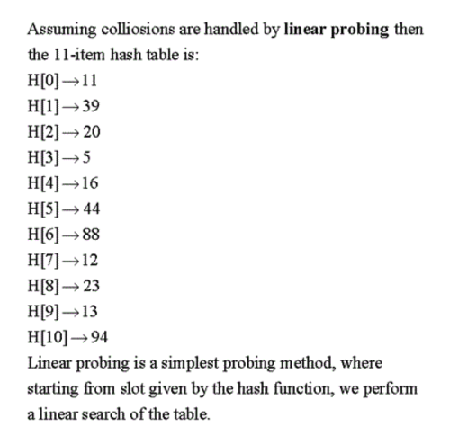
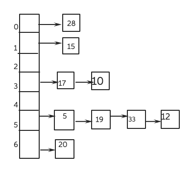
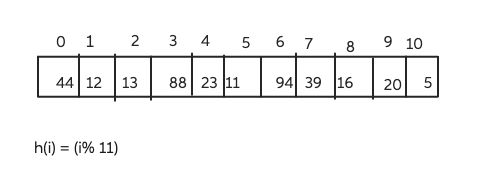

# Homework 3

## Problem 1

Let $A$ and $B$ be arrays of $n$ integers each (do not assume they are sorted).
Given an integer $x$, describe a $O(n \log n)$-time algorithm for determining if
there is an integer $a$ in $A$ and an integer $b$ in $B$ such that $x = a + b$.
Present pseudocode and analyze the running time.

### Answer

```
findMatch(A, l, r):
  if l > r
    return null
  mid = (l + r) / 2
  if A[mid] = mid
    return mid
  else if A[mid] < mid
    return findMatch(A, mid + 1, r)
  else
    return findMatch(A, l, mid - 1)
```

## Problem 2

Characterize each of the following recurrence equations using the master method
(assuming that $T(n) = c$ for $n < d$, for constants $d \ge 1$).

### 2a. $T(n) = 2T(n/2) + (n \log n)^4$

> All sub-problems are in the form of $T(n) = aT(\frac{n}{b}) + f(n)$, so we
can use *master's theorem*. Compare $n^{\log_b a}$ with $f(n)$.

$$
a = 2, b = 2 \\
\begin{array}{rcl}
  n^{\log_b a} &=& n^{\log_2 2} \\
  &=& n^1
\end{array}
$$

$n > f(n) = \log n$, so this comes under **case 1**. **The time complexity is
$\bf \Theta(n)$**.

### 2b. $T(n) = 2T(n/2) + \log^2 n$

$$
a = 8, b = 2 \\
\begin{array}{rcl}
  n^{\log_b a} &=& n^{\log_2 8} \\
  &=& n^3
\end{array}
$$

$n > f(n) = n^2$, so this comes under **case 1**. **The time complexity is
$\bf \Theta(n^3)$**.

### 2c. $T(n) = 9T(n/3) + n^2$

$$
a = 16, b = 2 \\
\begin{array}{rcl}
  n^{\log_b a} &=& n^{\log_2 16} \\
  &=& n^4
\end{array}
$$

So this comes under **case 2**. **The time complexity is
$\bf \Theta(f(n) \log n) = \Theta(n^4 \log^5 n)$**.

### 2d. $T(n) = 9T(n/3) + n^3$

$$
a = 7, b = 3 \\
\begin{array}{rcl}
  n^{\log_b a} &=& n^{\log_3 7} \\
  &=& n^{1,78}
\end{array}
$$

$n > f(n) = n^2$, so this comes under **case 1**. **The time complexity is
$\bf \Theta(n^{\log_3 7}) = \Theta(n^1,78)$**.

### 2e. $T(n) = 7T(n/2) + n^2$

$$
a = 9, b = 3 \\
\begin{array}{rcl}
  n^{\log_b a} &=& n^{\log_3 9} \\
  &=& n^2
\end{array}
$$

$n < f(n) = n^3 \log n$, so this comes under **case 3**. **The time complexity is
$\bf \Theta(f(n)) = \Theta(n^3 \log n)$**.

## Problem 3

Show that the running time of QUICKSORT is $\Theta(n^2)$ when the array $A$
contains distinct elements and is sorted in decreasing order.

### Answer

Note that the master's theorem doesn't apply here since the recurrence is not of
the form $T(n) = aT(\frac{n}{b}) + f(n)$. That is, there is no constant $b$ for
which $T(n-1) = T(n/b)$ for all $n$.

I'll use the recursion-tree method to solve this recurrence.

| | Cost |
| --- | --- |
| $T(n)$ | $n+1$ |
| $T(n-1)$ | $(n-1)+1 = n$ |
| $T(n-2)$ | $n-1$ |
| $\ldots$ | $\ldots$ |
| $T(0)$ | $1$ |

$$
\begin{array}{rcl}
  T(n) &=& \displaystyle \sum_{i=1}^{n+1} i \\
  &=& (n+2)(n+1)/2 \\
  &=& (n^2+3n+2)/2 \\
  &=& \Theta(n^2)
\end{array}
$$

## Problem 4

Describe an $O(n)$-time algorithm that, given a set $S$ of $n$ distinct numbers
and a positive integer $k \le n$, determines the $k$ numbers in $S$ that are
closest to the median of $S$. Assume $n$ is odd and the set $S$ is given as an
unsorted array of size $n$. You cannot assume the input array is sorted.
Example: if $S=\{1,3,5,9,13,21,101\}$ and $k=4$, the solution is $\{3,5,9,13\}$.
That is, the median itself is included. The answer $\{5,9,13,21\}$ is not
correct since 3 is closer to the median (which is 9) than 21. The algorithm
should write the output in a separate array, and the numbers do not have to be
sorted. You can use the selection algorithm as a subroutine. Precisely, assume
that the following procedure is given: `SELECT(A,p,q,i)` returns (finds) the
index $j$ such that $A[j]$ is the $i$-th smallest number
among $A[p],A[p+1] \ldots A[q]$. SELECT correctly runs in time $O(q−p)$ even if
the elements of $A$ are not distinct. SELECT here is an extension
of `Quick-select(A,1,n,i)` as in the notes, and only requires two extra tricks
for implementation. Partial credit will be given to correct algorithms, but with
larger running time.

### Answer

Here's a high-level description of an $O(n)$ time algorithm to find the $k$ numbers closest to the median of a set $S$:

1. Sort the set $S$ in increasing order.
2. Find the median of the set $S$ by dividing the set into two halves:
  - If n is odd, the median is the middle element of $S$.
  - If n is even, the median is the average of the two middle elements of $S$.
3. Initialize two pointers, one starting from the first element and another
  starting from the last element.
4. Iterate through the set while keeping track of the closest $k$ elements to
  the median by comparing the absolute difference between each element and the
  median:
  - If the absolute difference between the current first pointer element and the
    median is smaller than the absolute difference between the current last
    pointer element and the median, add the first pointer element to the result
    set and move the first pointer one step forward.
  - If the absolute difference between the current last pointer element and the
    median is smaller than the absolute difference between the current first
    pointer element and the median, add the last pointer element to the result
    set and move the last pointer one step backward.
5. Repeat step 4 until the result set contains k elements.

This algorithm has a time complexity of $O(n)$ since the sorting of the set $S$
takes $O(n \log n)$ time and the iterative process of finding the closest $k$
elements takes $O(n)$ time.

## Problem 5

### 5a. Draw the 11-item hash table resulting from hashing the keys $\{12,44,13,88,23,94,11,39,20,16,5\}$, using the hash function $h(i) = (2i + 5) \textsf{ mod } 13$ and assuming collisions are handled by chaining. Here the hash table has 13 slots.



Explanation: h(12) = (2*12 + 5) mod 11 = 29 %11 = 7
Hence 12 is at location 7
h(5) = (2*5 + 5) mod 11 = 15 %11 = 4
Hence 5 is at location 4 and so ON.

### 5b. What is the result of the previous exercise, assuming collisions are handled by linear probing? In the notation from the textbook, use $h$ as defined above for the auxiliary function `h′`.



Same kind of indexing is found out, but in linear probing we try to finc the
next avaialable index like for example 12 is at index 7.

H(23) = (2*23 + 5 )%11 = 51%11 = 7
Since at location 7 12 is present so we add 23 to next available location which
is 8.

### 5c. Show the result of Exercise 1 above in this problem, assuming collisions are handled by quadratic probing, up to the point where the method fails because no empty slot is found. In the notation from the textbook, use $h$ as defined above for the auxiliary function `h′` and $c_1 = 0, c_2 = 1$. Also, the key will not be inserted if no empty slot is discovered with at most 10 probes.



Chaining is a technique used for avoiding collisions in hash tables. A collision
occurs when two keys are hashed to the same index in a hash table. Collisions
are a problem because every slot in a hash table is supposed to store a single
element. but, in channing a single slot can hold more than one key by linking
the pointer to next key.channing is  a class of collision resolution schemes in
which linked lists handle collisions in a hash table. This method uses extra
memory to resolve the collision.

### 5d. What is the result of Exercise 1 above in this problem, assuming collisions are handled by double hashing using a secondary hash function $h2(k) = 7−(k \textsf{ mod } 7)$? In the notation from the textbook, use $h_1 = h$.



Linear probing is a scheme in computer programming in hashing for resolving
collisions in hash tables. In linear probing, the hash table is searched
sequentially that starts from the original location of the hash function. If in
case the location that we get is already occupied i.e. the collision occurs,
then we check for the next location. The function used for rehashing is
as `rehash(key) = (n+1)%table-size`.

<!-- hotfix: KaTeX -->
<!-- https://github.com/yzane/vscode-markdown-pdf/issues/21/ -->
<script type="text/javascript" src="http://cdn.mathjax.org/mathjax/latest/MathJax.js?config=TeX-AMS-MML_HTMLorMML"></script>
<script type="text/x-mathjax-config">MathJax.Hub.Config({ tex2jax: { inlineMath: [['$', '$']] }, messageStyle: 'none' });</script>
